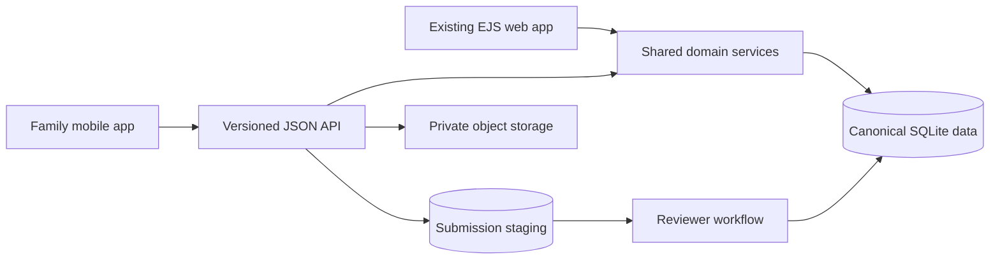

# AwardHome Mobile App — Family-First Product & Technical Design

**Status:** Proposed design, implementation not started  
**Date:** 2026-08-31  
**Audience:** Product, engineering, design, operations, and legal review

## 1. Executive Decision

Build a dedicated iOS and Android app for dancers and families using **React Native, TypeScript, Expo, and Expo Router**. Keep the existing Express/EJS application as the system of record, public web presence, and administrative workspace. Add a versioned JSON API and shared service layer; do not rebuild the backend or create a second database.

The app is not a wrapper around the website. Its purpose is narrower and more valuable:

> Make it effortless for a parent or dancer to find, claim, add, correct, preserve, and share their awards.

This supersedes the product direction in `phone_app_design.md`. Studio tools may receive a small mobile approval experience later, but organizer and full studio administration are not MVP goals.

## 2. Product Thesis

AwardHome cannot assume organizers will supply complete, structured results. Families have a stronger personal incentive: each missing award is part of their dancer's history. The mobile app should turn that incentive into reliable data without allowing unreviewed entries to weaken the archive.

The core loop is:

1. **Enter quickly:** search for a dancer or create a private pending profile.
2. **Recover what exists:** match and claim awards already in AwardHome.
3. **Capture what is missing:** photograph, upload, or manually enter evidence.
4. **Confirm before saving:** show extracted fields for human review; AI/OCR never silently asserts facts.
5. **Track trust:** show exactly what is pending, accepted, or needs attention.
6. **Celebrate:** present the trophy case beautifully and make sharing natural.

## 3. Product Principles

- **Family-first, not feature-parity:** optimize for a parent holding a phone at a competition, not for reproducing the web dashboard.
- **Capture now, reconcile safely:** drafts work offline; publication waits for server-side matching and review.
- **One archive:** the app and web use the same canonical organizations, events, studios, dancers, and awards.
- **Evidence is private by default:** certificates, screenshots, and result sheets support review but do not become public content automatically.
- **Provenance is permanent:** retain who submitted a fact, the evidence, decisions, and later corrections.
- **No shame labels:** use “Family submitted,” “Studio confirmed,” and “Source verified,” not a prominent red “unverified” badge.
- **Minimize minor data:** do not require birthdays, school information, precise location, contacts, or social profiles to add an award.
- **Trust is not popularity:** likes, payment, or repeated submissions cannot change placements or ranking.

## 4. Primary Users and Jobs

### Parent or guardian

- Manage one or more dancers from one household account.
- Recover awards already in the archive.
- Add a weekend's results in a few minutes.
- Understand review status without contacting support.
- Control profile visibility, photos, and sharing.

### Teen dancer

- View and share their trophy case.
- Suggest missing awards and corrections within the household's permissions.
- Add photos and acknowledgements under existing consent/moderation rules.

MVP accounts should be adult/guardian-led. Independent access for minors, shared guardianship, and dancer collaborator roles require a legal/privacy decision before launch.

### AwardHome reviewer

- Review a normalized submission beside its evidence and possible matches.
- Merge into an existing award, approve a new canonical award, request information, or reject.
- See duplicate, identity, and anomaly warnings before deciding.

## 5. Information Architecture

Use five primary destinations:

1. **Home** — household selector, recent awards, pending actions, and submission status.
2. **Trophy Case** — native, year-grouped award browsing with filters and card detail.
3. **Add** — prominent center action for finding or capturing an award.
4. **Activity** — claim decisions, submission progress, questions, and new matches.
5. **Account** — household, privacy, notification, export, and deletion controls.

Public search and trophy-case viewing should work without signing in. Require authentication only when claiming, contributing, or managing data.

## 6. Critical User Journeys

### First launch and profile recovery

1. Explain the value in one screen: “All their awards, one lasting home.”
2. Let the user search by dancer name plus optional studio and state.
3. If a profile exists, preview enough history to identify it, then start the existing claim process.
4. If no profile exists, verify the adult's email and create a private pending dancer profile.
5. Ask for notifications only after a claim/submission exists and the benefit is concrete.

Authentication should use emailed one-time codes first. Password login remains compatible with the website. Social login and passkeys can follow after the family workflow is proven.

### Add an award

The first question is: **“Is this award already on AwardHome?”** Search before creating.

If found, the user selects the award and submits the existing pending dancer link. Smart same-routine matching may suggest related awards, but every suggestion is visible before confirmation and tombstones remain respected.

If missing:

1. Select the dancer and studio.
2. Choose **Take a photo**, **Choose a screenshot/file**, or **Enter manually**.
3. Identify or enter competition, event/location, date/year, routine, placement, category, and optional division.
4. Review possible existing event/award matches.
5. Confirm a plain-language summary and submit.
6. Offer **Add another from this event**, retaining event, studio, and dancer context.

Evidence should be strongly encouraged but not mandatory. Evidence-free submissions stay review-only and cannot be automatically promoted.

### Batch capture at a competition

After the first submission, preserve an “event session” locally. A parent can add multiple placements for one routine or multiple routines without re-entering competition, location, year, studio, and dancers. The app uploads the session as individually reviewable submissions sharing one event candidate.

### Correction

A family never directly edits an imported canonical fact. “Something is wrong” creates a correction proposal showing the current value, proposed value, reason, and optional evidence. Reviewers accept or reject the proposal with an audit trail.

## 7. Trust and Publication Model

Separate **submission status**, **visibility**, and **verification level**. A single overloaded `verification_status` cannot express all three.

| Concern | Example states | Meaning |
|---|---|---|
| Submission | draft, submitted, needs_info, accepted, rejected, withdrawn | Workflow state |
| Visibility | private, owner_visible, public | Who can see the resulting record |
| Verification | family_submitted, corroborated, studio_confirmed, source_verified | Strength and origin of evidence |

Family submissions appear immediately in the household's private trophy case as **Pending**. Public promotion occurs only after a review rule succeeds. Initial rules should be conservative:

- Existing canonical award match: create a pending dancer link using the current claim flow.
- New award with clear evidence: human review in MVP.
- No evidence, identity ambiguity, conflicting facts, or suspected duplicate: human review or request more information.
- Later automation may promote high-confidence records when official-source matching or independent corroboration is proven reliable.

Published organizer/source data remains authoritative for event facts. Family submissions contribute missing facts and corrections; they never silently overwrite higher-authority data.

## 8. Proposed Data Model

Do not create canonical `events` or `awards` directly from the mobile request. Add a staging model:

- `award_submissions`: submitter, dancer, raw fields, normalized fields, client idempotency key, workflow status, candidate award/event, reviewer decision, timestamps.
- `award_submission_dancers`: additional dancers for duo/group entries without forcing premature identity matches.
- `award_submission_evidence`: private object key, media type, checksum, uploader, consent context, scan status, retention state.
- `award_corrections`: canonical award, field-level before/proposed values, evidence, decision.
- `award_provenance`: canonical award, source type, originating submission/import, contributor, verification level, decision date.
- `mobile_sessions`: hashed opaque refresh token, device label, rotation/revocation timestamps.
- `push_devices`: user, platform, Expo/device token, preferences, last success, disabled timestamp.

Use UUIDs for client-created submission IDs and a unique `(user_id, client_submission_id)` constraint. Retried offline uploads must return the original result, never create duplicates.

For family collaboration, retain `dancers.claimed_by_user_id` as the primary owner during MVP. Design a later `dancer_collaborators` table with explicit guardian, dancer, contributor, and read-only roles instead of sharing credentials.

## 9. Technical Architecture

Both clients share business rules, but only reviewed promotions write mobile-contributed facts into canonical awards.

### Mobile client

- `mobile/` — Expo application in the same repository, with its own `package.json`.
- TypeScript with strict mode and Expo Router typed routes.
- Development builds for real camera, notification, universal-link, and secure-storage testing.
- `expo-secure-store` for the refresh token; access tokens remain in memory.
- `expo-sqlite` for owned-profile cache, drafts, event sessions, and an offline outbox.
- Camera/photo selection through Expo system APIs with narrowly worded permissions.
- EAS Build/Submit for store binaries and separate preview/production channels. EAS Update may ship compatible JavaScript fixes only after preview validation.

Expo currently recommends Expo Router for new Expo apps and provides automatic deep linking, which fits AwardHome's existing shareable web URLs. Expo's persistent SQLite support is appropriate for offline drafts, while encrypted secrets belong in SecureStore rather than general app storage. See [Expo Router](https://docs.expo.dev/router/introduction/), [data storage](https://docs.expo.dev/develop/user-interface/store-data/), and [EAS](https://docs.expo.dev/eas/).

### Backend

- Add `/api/v1/mobile/` routers; never expose EJS routes as an accidental API.
- Extract shared claim, dancer, award, matching, privacy, and moderation behavior into `services/` used by both web routes and API controllers.
- Publish an OpenAPI contract and generate the mobile TypeScript client/types from it.
- Use cursor pagination and `updated_since` synchronization rather than returning a dancer's complete history on every launch.
- Keep SQLite as the canonical database initially. Move uploads to S3/R2-compatible object storage before public evidence collection; use short-lived upload grants, MIME sniffing, size limits, malware scanning, image re-encoding, and EXIF removal.
- Keep the existing staged import pipeline separate. Mobile submissions enter their own review pipeline and only converge at canonical promotion.

### Authentication

Use revocable opaque bearer tokens, not long-lived JWTs. The API issues a short-lived access token and rotating refresh token; only hashes of refresh tokens are stored server-side. Rate-limit code requests and verification attempts, revoke all device sessions after password/account security changes, and show active devices in Account.

Universal links such as `https://awardhome.com/dancer/<id>` should open the matching app screen and fall back to the website when the app is absent. Expo Router supports this model directly.

## 10. OCR and Assisted Entry

OCR is an accelerator, not the source of truth. Build it after the manual/photo submission pipeline works end to end.

The extraction contract should return each proposed field with source text, confidence, and bounding region. Low-confidence fields remain blank. The user must review every extracted field before submission. Never infer a placement, dancer identity, or studio solely from visual proximity without confirmation.

Recommended sequence:

1. MVP: photo/file evidence plus fast manual fields and event-session reuse.
2. Assisted entry: OCR for one certificate or result screenshot.
3. Structured matching: suggest known org, event, studio, and dancer candidates.
4. Batch import: multi-row result-sheet review.
5. Share-to-AwardHome extension: send a screenshot/PDF from another app into a new draft.

## 11. Trophy Case and Sharing

The browsing experience should be native and fast, while preserving the Rafters design language: stage black, champagne/gold, engraved typography, banners, and celebratory motion with reduced-motion support.

Do not port the full web flip-book first. MVP cards show placement, routine, event, year, studio, trust state, and a deep link. Card detail can progressively add the certificate, photo, acknowledgement, and colophon pages. Centralize colors, typography names, tiers, and copy in a platform-neutral token file, but accept that EJS/CSS and React Native renderers are separate implementations.

Generate canonical share images server-side so web and app do not drift. The app invokes the native share sheet with the image plus the public HTTPS deep link. Evidence images are never used as share media.

## 12. Privacy, Safety, and Store Readiness

AwardHome serves families and includes minors, so privacy review is a release gate, not cleanup work.

- Default new profiles and submissions to private until ownership and publication rules are satisfied.
- Keep precise birthday optional and private; prefer age division or graduation year when sufficient.
- Request camera/photo permissions only when the user chooses that action, with a manual alternative.
- No third-party advertising SDKs, cross-app tracking, public chat, direct messaging, or public comments in MVP.
- Reuse moderation, consent, flagging, privacy, and ranking opt-out controls from the web product.
- Provide accessible privacy policy, data export, evidence deletion, notification controls, and in-app account deletion before store submission.
- Keep an external web deletion-request path for Google Play compliance.
- Define deletion semantics explicitly: remove credentials, sessions, push tokens, private drafts/evidence, and user-generated card content as applicable. Published competition records may require a separate correction/takedown path rather than silent historical erasure; disclose that distinction before confirmation and obtain legal review.

Apple requires in-app account deletion when account creation is supported and imposes moderation/privacy duties for user-generated content and minors. Google Play requires both an in-app deletion path and a web deletion-request resource for apps that create accounts. See the [Apple App Review Guidelines](https://developer.apple.com/app-store/review/guidelines/) and [Google Play account deletion requirements](https://support.google.com/googleplay/android-developer/answer/13327111).

An attorney should review the adult/teen account model, COPPA and state youth-privacy implications, consent language, retention, and store age rating before beta expands beyond invited families.

## 13. Delivery Phases

### Phase 0 — Backend and research foundation

- Interview 8–12 dance families using their real result artifacts.
- Prototype the Add flow and event-session flow before coding.
- Define API contract, submission schema, object storage, review queue, deletion flow, and privacy rules.
- Extract shared backend services and add throwaway-database API tests.

### Phase 1 — Read, recover, and claim

- Guest search, email-code sign-in, household dashboard, native trophy case, profile claiming, missing-award search, activity states, and universal links.
- Test with internal builds and a small invited family cohort.

### Phase 2 — Family submission MVP

- Offline drafts, photo/manual capture, event sessions, idempotent upload, reviewer queue, needs-information loop, correction proposals, and private pending awards.
- Add push notifications for decisions and questions, not marketing.

### Phase 3 — Assisted capture and sharing

- OCR suggestions, stronger duplicate/event matching, server-generated share images, share-to-app intake, and corroboration experiments.

### Phase 4 — Collaboration and selective studio support

- Co-guardian/dancer contributor roles and recovery controls.
- A small studio approval inbox only if it materially shortens family review time; do not port the full studio dashboard.

## 14. Success and Guardrail Metrics

Primary outcome: **accepted awards added or recovered per activated household**, without reducing archive trust.

Measure:

- Search-to-claimed-profile conversion.
- Median time to first recovered or submitted award.
- Add-flow completion and evidence attachment rates.
- Accepted, duplicate-merged, needs-information, and rejected submission rates.
- Median review time and reviewer minutes per accepted award.
- OCR field correction rate before submission.
- Four-week household retention and share rate.
- Upload retry/duplication rate, crash-free sessions, and API error rate.
- Contested ownership/link rate, privacy incidents, improper-publication count, and deletion completion time.

Do not optimize raw submission volume in isolation. A faster funnel that creates duplicates or false dancer links is a product regression.

## 15. Explicit Non-Goals for MVP

- Organizer result submission or organizer dashboards.
- Full studio roster, analytics, branding, and awards-editor parity.
- Public social feed, chat, follower graph, or open comments.
- Automatic publication from OCR alone.
- Replacing the public website or its SEO routes.
- PostgreSQL migration solely because a mobile client exists.
- Paid subscriptions, ads, or sponsor placements inside data entry.

## 16. Decisions Required Before Implementation

1. Confirm adult-led MVP accounts and the minimum age/consent policy.
2. Choose S3 or R2-compatible evidence storage and retention periods.
3. Define which family submissions can become public and who reviews them.
4. Decide whether evidence is deleted after verification or retained privately for disputes.
5. Approve the five-tab prototype and the exact first-run claim/create flow.
6. Set beta capacity based on reviewer throughput, not download targets.

The first implementation artifact should be a clickable Add Award prototype tested with real families and real certificates/screenshots. The first production code should then establish the submission API and review path before building polished OCR or card animation.
