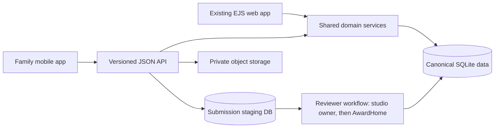

# AwardHome Mobile App — Family-First Product & Technical Design (v2)

**Status:** Proposed design, implementation not started
**Date:** 2026-08-31
**Supersedes:** `docs/mobile_family_app_design.md` (v1). v1 remains for comparison.
**Audience:** Product, engineering, design, operations, and legal review

## What changed in v2, and why

v1 was structurally right: staging instead of canonical writes, a three-axis
trust model, OCR last. v2 keeps all of that. The changes come from two inputs.

**Q's product decisions (2026-08-31).** Families never type a studio — they are
already affiliated with one, or self-identify as independent. Families *may*
create an event when they cannot find it, with an optional event photo, and it
must become selectable by other families at that event immediately. Families
pick an explicit group size, and can supply teacher and choreographer — data
organizers usually omit. Studio owners are the preferred reviewer pool.

**Evidence from the 2026-08-30/31 data-repair work.** That session merged
**3,386 duplicate studios** and **~2,950 duplicate dancer profiles**, repaired
**79,181** solos whose primary-dancer link was never written, and found
**1,874** group awards carrying exactly one linked dancer. Every one of those
was produced by a *machine* following consistent rules. A family-submission
firehose is the same failure class at higher volume with messier input, so v2
treats entity resolution as a designed feature of the entry flow rather than a
burden on review.

The substantive deltas:

| # | v1 | v2 |
|---|---|---|
| 1 | Family "selects dancer and studio" | Studio is **derived from affiliation**, never entered |
| 2 | Family cannot create events | Family **may create an event candidate**, instantly selectable by others |
| 3 | Group dancers as a submission side-table | **Explicit group size** drives the canonical write path |
| 4 | — | **Teacher/choreographer capture** (organizers rarely publish it) |
| 5 | Studio approval inbox in Phase 4 | Studio owners are the **primary reviewer pool**, pulled early |
| 6 | Photos as later card pages | **Media is co-equal with data** from Phase 2 |
| 7 | Review is the safeguard | **Convergence + corroboration** reduce review volume |

---

## 1. Executive Decision

Build a dedicated iOS and Android app for dancers and families using **React
Native, TypeScript, Expo, and Expo Router**. Keep the existing Express/EJS
application as the system of record, public web presence, and administrative
workspace. Add a versioned JSON API and shared service layer; do not rebuild
the backend or create a second database.

The app is not a wrapper around the website:

> Make it effortless for a parent or dancer to find, claim, add, correct,
> preserve, and share their awards — and to attach the memories only they have.

## 2. Product Thesis

AwardHome cannot assume organizers will supply complete, structured results.
They are busy with their own events and have little incentive. Families have a
strong personal incentive: each missing award is part of their dancer's
history. The app turns that incentive into reliable data — without letting
unreviewed entries weaken the archive.

The core loop:

1. **Enter quickly** — the household's dancers and their studio are already known.
2. **Recover what exists** — match and claim awards already in AwardHome.
3. **Capture what is missing** — photograph, upload, or enter manually.
4. **Confirm before saving** — extracted fields are reviewed by a human; OCR never asserts silently.
5. **Track trust** — show what is pending, accepted, or needs attention.
6. **Celebrate and preserve** — the trophy case, plus the photos, notes, and voices only families have.

## 3. Product Principles

- **Family-first, not feature-parity.** Optimise for a parent holding a phone at a competition.
- **Resolve by affiliation, not by typing.** The fewer identifiers a family types, the fewer duplicates the archive absorbs.
- **Capture now, reconcile safely.** Drafts work offline; publication waits for server-side matching and review.
- **One archive.** App and web share canonical organizations, events, studios, dancers, and awards.
- **Evidence is private by default.** Certificates and result sheets support review; they never become public content automatically.
- **Provenance is permanent.** Who submitted a fact, the evidence, the decision, and later corrections are all retained.
- **No shame labels.** "Family submitted", "Studio confirmed", "Source verified" — never a red "unverified" badge.
- **Minimise minor data.** No birthday, school, precise location, contacts, or social profile required to add an award.
- **Trust is not popularity.** Likes, payment, or repeat submissions cannot change placements or ranking.
- **Media is not a nicety.** Photos, notes and voices are the part of the record no organizer will ever supply.

## 4. Primary Users and Jobs

### Parent or guardian
Manage one or more dancers from one household. Recover archived awards. Add a
weekend's results in minutes. Understand review status without contacting
support. Control visibility, photos, and sharing.

### Teen dancer
View and share their trophy case. Suggest missing awards and corrections within
household permissions. Add photos and acknowledgements under existing consent
and moderation rules.

MVP accounts are adult/guardian-led. Independent minor access, shared
guardianship, and dancer collaborator roles need a legal/privacy decision first.

### Studio owner (reviewer)
Confirm or correct submissions from their own dancers, in a small mobile inbox.
They already know the dancers, the routines, and the results — see §7.

### AwardHome reviewer
Handle what studios cannot: unaffiliated dancers, disputes, cross-studio
conflicts, and anomalies.

## 5. Information Architecture

Five destinations: **Home**, **Trophy Case**, **Add** (centre action),
**Activity**, **Account**.

Public search and trophy-case viewing work without signing in. Authentication
is required only to claim, contribute, or manage.

---

## 6. Critical User Journeys

### 6.1 First launch, affiliation, and profile recovery

1. One value screen: "All their awards, one lasting home."
2. Search by dancer name, optionally studio and state.
3. If a profile exists, preview enough history to identify it, then run the existing claim flow.
4. If none exists, verify the adult's email and create a **private pending dancer profile**.
5. Ask for notifications only once a claim or submission exists.

Authentication uses emailed one-time codes first; password login stays
compatible with the website. Social login and passkeys can follow.

### 6.2 Studio affiliation — the reason families never type a studio

**A household's dancers carry their studio with them.** Affiliation comes from
`dancer_studios`, established when the family claims a rostered dancer profile
or when a studio owner adds them. The Add flow reads the studio; it is never a
free-text field. This eliminates the single largest duplicate vector at the
source — better than resolving it afterwards.

Three cases must be designed explicitly:

- **Rostered dancer (the common case).** Studio is derived. No input.
- **Independent dancer.** The family self-identifies as independent. This is
  already representable — **2,294 awards currently carry no studio and 493
  dancers sit on no roster** — but see the warning in §16.1: several server
  rules assume a studio exists.
- **Multi-studio dancer.** Switchers and cross-studio collaborations. Only **7**
  dancers are on more than one studio today, so this is rare, but the Add flow
  must ask *which* studio a routine was danced for rather than guessing. Note
  the platform's existing convention: a cross-studio collaboration is its own
  pseudo-studio row, and dancers bridge the affiliations via `dancer_studios`.

A studio switch mid-season is normal and must not rewrite history: past awards
keep the studio they were danced for.

### 6.3 Add an award

The first question is always: **"Is this award already on AwardHome?"**

**If found** — the family submits a pending dancer link through the existing
claim flow. No new canonical row, no new review queue. Same-routine matching
may suggest related awards; every suggestion is visible before confirmation and
removal tombstones are always respected.

**If missing**, the family supplies only what they actually know:

1. **Dancer** — from the household. Studio derived (§6.2).
2. **Event** — see §6.4.
3. **Routine name.**
4. **Group size** — solo, duet, trio, small group, large group, line, grand
   line, production. *Required*, because it determines the canonical write path
   (§6.5) and how the card renders.
5. **Placement and category/division.**
6. **Teacher and choreographer** — optional, credited (§6.6).
7. **Evidence** — photo, screenshot, file, or none.
8. **Confirm** a plain-language summary, then submit.
9. **Add another from this event** retains event, studio, dancer, and teacher context.

Evidence is strongly encouraged but not mandatory. Evidence-free submissions
stay review-only and are never auto-promoted.

**Client-side normalisation, server-side enforcement.** The app trims and
collapses whitespace, strips stray punctuation, and normalises case for display
before submitting — this is what makes the *reviewer's* job easy. It is a UX
affordance, not a guarantee: the server re-normalises everything on receipt.
The tab-damaged names cleaned up on 2026-08-31 are exactly what leaks in when
only one side does this.

### 6.4 Event identity — pick first, create only if truly absent

Event identity is the hardest free-text problem in this domain, and AwardHome
already owns the asset that mostly solves it: **1,056 active upcoming events,
1,080 of them geocoded**, plus 4,214 canonical historical events.

**Picking (the common path).** At a competition the app geolocates and asks:

> *"Are you at Starpower — San Jose today?"*

One tap. Every submission that weekend binds to the same event. Fall back to
browse-by-organization-and-date when location is unavailable or declined.

**Creating (the exception).** If the family genuinely cannot find it, they may
create one, with an optional **event photo** (banner, programme cover,
backdrop). Per Q's decision it becomes **immediately selectable by other
families**, so a second parent at the same event is not forced to create a
duplicate.

To get both — instant availability *and* an archive that stays clean — new
events are `event_candidates`, not canonical `events`:

- Immediately visible and selectable, scoped by **date window and geography**,
  so the families who need it see it and nobody else does.
- Labelled "Added by a family" in the picker, so it reads as provisional.
- **Deduplicated at creation.** Before the form opens, show any candidate
  already created for that date and area: *"Someone here added 'Starquest
  Spring Classic' 20 minutes ago — is that yours?"* This is the race that
  otherwise produces two candidates for one event within minutes.
- Promoted to canonical by a reviewer, or auto-merged into a canonical event
  when the organizer's own data lands later through the import pipeline.
- The event photo doubles as **dedup evidence**: two candidates with the same
  banner are the same event.

The rule that stays firm from v1: **no new canonical award without a matched
event** — candidate or canonical. An award floating free of an event is
unreviewable and unmergeable.

### 6.5 Group size drives the write path

This is the schema's sharpest edge, and family entry hits it constantly.

The platform's convention: **solos double-write `awards.dancer_id` *and* the
`award_dancers` junction; groups use the junction only.** The 2026-08-31 repair
had to seat 79,181 solo primary dancers that importers never wrote.

The failure mode families will produce daily: **a parent enters a group routine
but only their own child.** That record is indistinguishable from a solo unless
the format is recorded — and there are already **1,874 group awards with
exactly one linked dancer** in the archive, which is why the repair tooling
needs a positive-identification rule rather than inferring from link count.

So group size is required, and it means:

- **Solo/duet/trio** — small, enumerable casts; the family can reasonably name everyone.
- **Group/line/production** — the family names their own dancer and marks the
  cast **incomplete**. The record is explicitly partial, never mistaken for a solo.
- Later submissions from other households **converge** onto the same award
  (§7.3) instead of creating a second one.

### 6.6 Teacher and choreographer — data organizers rarely publish

Families know who taught and choreographed the routine; most organizers never
print it. Capturing it is a genuine differentiator and feeds the planned
teacher/choreographer credit graph.

⚠ **This has an IP gate already on file.** `TODOS_and_DONE.md` records:
*"Teacher & choreographer accounts + card credits (two-sided accept; see
ideas.md §11). IP: add credit-granularity embodiment to the follow-on
provisional queue before building."* Capturing the names as award metadata is
almost certainly fine; building the **credit graph and two-sided accept** is
the part that gate covers. Close it before shipping that feature — A11 was
publicly disclosed on 2026-08-30 by a deploy that shipped ahead of exactly this
kind of gate.

### 6.7 Batch capture at a competition

After the first submission, the **server issues an event session id** and the
app keeps the session locally. A parent adds multiple placements for one
routine, or multiple routines, without re-entering competition, location, year,
studio, dancers, or teacher.

Server-side session identity (a change from v1, where the session was purely
local) is what lets reviewers approve a weekend in one pass and lets
convergence work across households.

### 6.8 Correction

A family never directly edits an imported canonical fact. "Something is wrong"
creates a correction proposal showing current value, proposed value, reason,
and optional evidence. Reviewers accept or reject with an audit trail.

### 6.9 Contested claims

Two households claiming the same dancer is a real scenario, not an edge case
(same-name dancers, separated parents, a studio and a parent both claiming).
`dancer_claims` already models pending/contested states. The app needs an
explicit journey: neither claimant silently wins, the profile stays private
while contested, and an AwardHome reviewer — not a studio — resolves it.

---

## 7. Trust and Publication Model

Separate **submission status**, **visibility**, and **verification level**. One
overloaded `verification_status` cannot express all three.

| Concern | Example states | Meaning |
|---|---|---|
| Submission | draft, submitted, needs_info, accepted, rejected, withdrawn | Workflow state |
| Visibility | private, owner_visible, public | Who can see the record |
| Verification | family_submitted, corroborated, studio_confirmed, source_verified | Strength and origin of evidence |

Family submissions appear immediately in the household's private trophy case as
**Pending**. Public promotion happens only when a rule succeeds.

### 7.1 Studio owners are the primary reviewer pool

AwardHome staff review does not scale: v1 measures "reviewer minutes per
accepted award" without designing the number down. Studio owners already know
their dancers, routines, and results, already have dashboards, and are already
motivated — their studio's page is the showcase.

So the studio approval inbox moves **out of Phase 4 and into Phase 2**, in
minimal form: a list of their own dancers' pending submissions with
confirm/correct/reject. This is the difference between review scaling with
AwardHome's headcount and scaling with the network.

Guardrails, reusing what exists: a studio owner can confirm only their own
dancers' submissions; the platform's rogue-studio containment (provenance-scoped
freeze-and-release, per-studio daily thresholds) applies unchanged; and a studio
confirmation is `studio_confirmed`, still below `source_verified`.

### 7.2 Promotion ladder

| Case | Path |
|---|---|
| Claim of an existing canonical award | Existing claim flow — no new review |
| New award, matched event, **studio confirmed** | Promote |
| New award, matched event, **corroborated** by an unrelated household | Promote |
| New award, evidence, no corroboration | Human review |
| No evidence, identity ambiguity, conflicting facts, suspected duplicate | Human review or request info |

Published organizer/source data stays authoritative for event facts. Family
submissions add missing facts and corrections; they never silently overwrite
higher-authority data.

### 7.3 Convergence and corroboration

Two parents at the same event will both submit *Small Group — Fireworks — 1st*.
Keyed on **(event, routine, studio, group size)** that is **one award with two
dancer links**, not two awards.

This is the cheapest trust signal available: independent submissions from
unrelated households, neither able to see the other's entry, agreeing on a
result. It operationalises the `corroborated` tier v1 named but left abstract,
and it is what makes a group routine's cast fill in over a season without any
single parent typing eight names.

Convergence must respect tombstones: a dancer a director removed is never
re-added by another household's submission.

---

## 8. Proposed Data Model

Never create canonical `events` or `awards` directly from a mobile request.

**Staging**
- `award_submissions` — submitter, dancer, studio (derived), raw + normalised fields, **group size**, teacher, choreographer, client idempotency key, workflow status, candidate award/event, event session id, reviewer decision, timestamps.
- `award_submission_dancers` — additional named cast for solo/duet/trio, and a `cast_complete` flag for groups.
- `award_submission_evidence` — private object key, media type, checksum, uploader, consent context, scan status, retention state.
- `event_candidates` — org (if known), name, date, city/state, geo, optional photo, creator, dedup cluster, promotion/merge decision. **Selectable immediately; canonical only after review or merge.**
- `award_corrections` — canonical award, field-level before/proposed values, evidence, decision.
- `award_provenance` — canonical award, source type, originating submission/import, contributor, verification level, decision date.

**Client/session**
- `mobile_sessions` — hashed opaque refresh token, device label, rotation/revocation timestamps.
- `push_devices` — user, platform, token, preferences, last success, disabled timestamp.

Client-created submission ids are UUIDs with a unique `(user_id,
client_submission_id)` constraint: a retried offline upload returns the original
result and never duplicates.

`dancers.claimed_by_user_id` stays the primary owner for MVP. A later
`dancer_collaborators` table adds guardian / dancer / contributor / read-only
roles — never shared credentials.

**Put the staging tables in their own SQLite file.** The repo already has this
pattern (`DB_PATH` override, `staging_import.sqlite`). SQLite serialises
writers, and a submission spike should not contend with the serving database —
a long write transaction was observed against production during the
2026-08-31 studio merge. It also defers the Postgres question honestly rather
than indefinitely (§16.4).

## 9. Technical Architecture

### Mobile client
- `mobile/` — Expo app in this repository with its own `package.json`.
- TypeScript strict mode; Expo Router typed routes.
- Development builds for real camera, notifications, universal links, secure storage.
- `expo-secure-store` for the refresh token; access tokens in memory only.
- `expo-sqlite` for owned-profile cache, drafts, event sessions, offline outbox.
- Camera/photo via Expo system APIs with narrowly worded permissions.
- EAS Build/Submit with separate preview and production channels; EAS Update only for compatible JS fixes after preview validation.

### Backend
- Add `/api/v1/mobile/` routers; never expose EJS routes as an accidental API.
- Extract shared claim, dancer, award, matching, privacy, and moderation logic into `services/` used by both web routes and API controllers.
- **Reuse the existing resolvers rather than writing new ones**: `utils/resolveStudio.js` (exact → whitespace → case → spacing → punctuation, following `merged_into_id`) and `utils/resolveDancer.js` (name + studio, routine as tie-breaker). These encode hard-won rules; a second identity model would diverge.
- Publish an OpenAPI contract; generate the mobile client and types from it.
- Cursor pagination and `updated_since` sync, not full history per launch.
- Move uploads to S3/R2-compatible storage before public evidence collection: short-lived upload grants, MIME sniffing, size limits, malware scanning, image re-encoding, EXIF removal.
- Keep the staged organizer import pipeline separate; the two converge only at canonical promotion.

### Authentication
Revocable opaque bearer tokens, not long-lived JWTs: short-lived access token
plus rotating refresh token, only hashes stored server-side. Rate-limit code
requests and verification attempts, revoke all device sessions after a security
change, and list active devices in Account.

Universal links (`https://awardhome.com/dancer/<id>`) open the matching app
screen and fall back to the website.

### Abuse limits
Mobile submission is a new write vector and needs the equivalent of the
platform's existing rogue-studio thresholds: **per-household daily caps** on
submissions, dancer links, and event-candidate creation, with soft-fail
(queue + notify) rather than hard rejection. Without this, freeze-and-release
tooling has nothing to scope against.

## 10. OCR and Assisted Entry

OCR is an accelerator, not a source of truth. Build it after manual/photo
submission works end to end.

The extraction contract returns each proposed field with source text,
confidence, and bounding region. Low-confidence fields stay blank. The user
reviews every extracted field. Never infer placement, dancer identity, or
studio from visual proximity alone.

Sequence: manual + event-session reuse → single-certificate OCR → structured
matching against known org/event/studio/dancer candidates → multi-row result
sheets → share-to-AwardHome from another app.

## 11. Trophy Case, Media, and Sharing

Native, fast, year-grouped browsing in the Rafters language: stage black,
champagne/gold, engraved type, banners, celebratory motion with reduced-motion
support.

Do not port the full web flip-book first. MVP cards show placement, routine,
event, year, studio, trust state, and a deep link.

**Media is elevated from v1.** The multi-page card is the patent-pending
differentiator (provisional 64/142,611), and photos, thank-you notes, and
voices are the one part of the record that organizers will never supply. A
phone at a competition is the only place that content realistically gets
captured. So **"add a photo or thank-you note to this award" is a first-class
Phase 2 action**, not a Phase 3 nicety — it is likely a stronger retention
driver than data entry, and it feeds the card pages directly under existing
consent and moderation rules.

Generate canonical share images server-side so web and app cannot drift. The
app invokes the native share sheet with the image plus the public HTTPS deep
link. **Evidence images are never share media.**

## 12. Privacy, Safety, and Store Readiness

Privacy review is a release gate, not cleanup.

- New profiles and submissions default to private until ownership and publication rules are satisfied.
- Precise birthday optional and private; prefer age division or graduation year.
- Camera/photo permission requested only on the action, with a manual alternative.
- No third-party ad SDKs, cross-app tracking, public chat, DMs, or public comments in MVP.
- Reuse the web product's moderation, consent, flagging, and ranking opt-out. **Surface the per-card Public/Hidden toggle and rankings opt-out at claim time**, not buried in Account — that is the moment a parent is deciding what the world sees.
- Accessible privacy policy, data export, evidence deletion, notification controls, and in-app account deletion before store submission.
- Keep an external web deletion-request path for Google Play.
- Define deletion semantics explicitly: credentials, sessions, push tokens, private drafts/evidence, and user-generated card content. Published competition records may need a correction/takedown path rather than silent historical erasure — disclose the distinction before confirmation, with legal review.

Apple requires in-app account deletion and imposes moderation/privacy duties
for user-generated content and minors; Google Play requires in-app deletion plus
a web deletion resource. An attorney should review the adult/teen account model,
COPPA and state youth-privacy implications, consent language, retention, and age
rating before beta expands beyond invited families.

## 13. Delivery Phases

### Phase 0 — Foundation and research
- Interview 8–12 dance families with their real artifacts.
- Prototype the Add flow and the event picker/creation flow before coding.
- Define API contract, submission schema, **event-candidate lifecycle**, object storage, review queue, deletion flow, privacy rules.
- Extract shared services; add throwaway-database API tests.

### Phase 1 — Read, recover, claim
- Guest search, email-code sign-in, household dashboard, native trophy case, profile claiming, **affiliation resolution**, missing-award search, activity states, universal links.
- Internal builds plus a small invited cohort.

### Phase 2 — Family submission MVP *(scope widened from v1)*
- Offline drafts, photo/manual capture, **event picker + candidate creation**, **group size**, teacher/choreographer, server-issued event sessions, idempotent upload, needs-info loop, correction proposals, private pending awards.
- **Minimal studio-owner approval inbox** (§7.1).
- **Photo / thank-you-note attachment** (§11).
- Push notifications for decisions and questions only — never marketing.

### Phase 3 — Assisted capture and sharing
- OCR suggestions, stronger duplicate/event matching, **convergence and corroboration promotion**, server-generated share images, share-to-app intake.

### Phase 4 — Collaboration and depth
- Co-guardian and dancer contributor roles, recovery controls.
- Teacher/choreographer credit graph — **only after the IP gate in §6.6 is closed**.

## 14. Success and Guardrail Metrics

Primary outcome: **accepted awards added or recovered per activated household**,
without reducing archive trust.

**Funnel** — search-to-claimed-profile conversion; median time to first
recovered or submitted award; add-flow completion; evidence attachment rate;
four-week household retention; share rate.

**Review economics** — accepted / duplicate-merged / needs-info / rejected
rates; median review time; **share of submissions cleared by a studio owner
rather than AwardHome staff**; reviewer minutes per accepted award.

**Archive integrity (new in v2 — the numbers that catch silent decay)**
- **New canonical studios created per 100 accepted submissions** — should be ~0 under the affiliation model.
- **Event candidates created per event that already existed** — measures picker quality.
- **Duplicate canonical awards created**, and duplicates merged per week.
- **Group awards left with a single linked dancer** — the 1,874 baseline should fall, not rise.
- **Convergence rate** — share of group awards receiving links from more than one household.

**Reliability** — upload retry/duplication rate, crash-free sessions, API error
rate, contested ownership rate, privacy incidents, improper publications,
deletion completion time.

Do not optimise raw submission volume. A faster funnel that creates duplicates
or false dancer links is a product regression.

## 15. Explicit Non-Goals for MVP

- Organizer result submission or organizer dashboards.
- Full studio roster, analytics, branding, and awards-editor parity (the approval inbox in §7.1 is deliberately minimal).
- Public social feed, chat, follower graph, open comments.
- Automatic publication from OCR alone.
- Replacing the public website or its SEO routes.
- PostgreSQL migration merely because a mobile client exists.
- Paid subscriptions, ads, or sponsor placements inside data entry.

## 16. Decisions Required Before Implementation

### 16.1 The independent-dancer model ⚠ *new in v2*
Self-identifying as independent is representable — 2,294 awards already carry no
studio and 493 dancers sit on no roster — but **several server rules assume a
studio exists**: `resolveDancer` requires a `studioId`; the solo primary-dancer
repair resolves ambiguity by matching a dancer's studio to the award's studio;
the collapsed-solo repair uses the same key. An independent dancer bypasses all
three. Decide whether independents get a synthetic "Independent" studio row per
dancer, a nullable path with its own resolution rules, or are deferred past MVP.
This is the one v2 change that touches existing invariants.

### 16.2 Event-candidate lifecycle
Visibility radius and date window; who promotes a candidate to canonical; what
happens when the organizer's own import later lands the same event (auto-merge
rule); whether an event photo is retained after promotion.

### 16.3 Reviewer model
Confirm studio owners as the primary pool; define what only AwardHome may
decide (contested claims, cross-studio conflicts, independents); set beta
capacity from reviewer throughput, not downloads.

### 16.4 Storage and scale
S3 vs R2; evidence retention period; whether evidence is deleted after
verification or kept privately for disputes; the **named trigger** for a
Postgres migration (sustained p95 write latency or write-contention rate) so it
is a measured decision rather than an open question.

### 16.5 Accounts and consent
Adult-led MVP accounts, minimum age, consent policy, and the exact first-run
claim/create flow.

### 16.6 IP gate on credits
Close the teacher/choreographer credit-graph provisional (§6.6) before building
that feature — not after deploying it.

---

The first implementation artifact should be a clickable **Add Award** prototype
tested with real families and real certificates — with the **event picker** and
**group size** steps in it, since those are where the archive's integrity is won
or lost. The first production code should establish the submission API,
event-candidate lifecycle, and studio review path before any polished OCR or
card animation.
